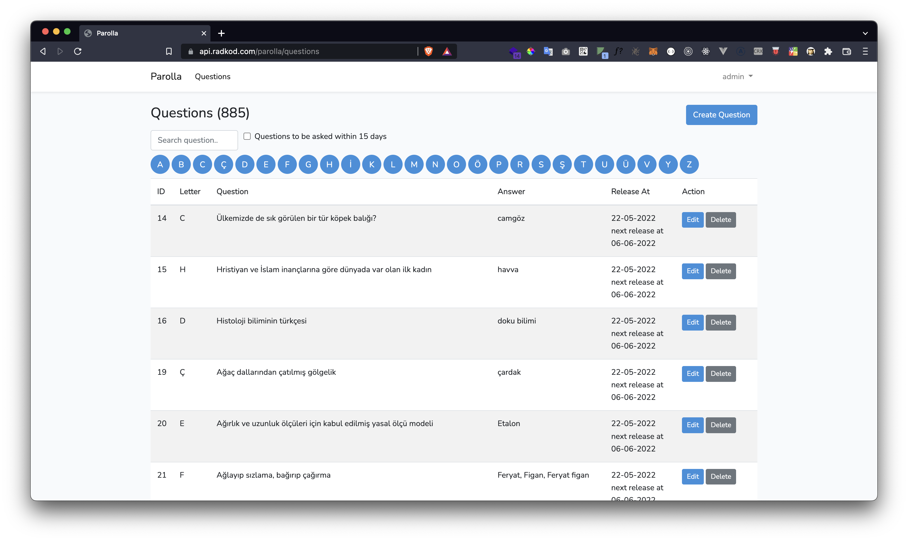

# Parolla - Backend

Preview
-

Install
-
* .env.example copy -> .env
* ``php artisan key:generate``
* ``php artisan storage:link``
* ``php artisan migrate``
* ``php artisan db:seed``
* ``composer update``
* ``npm install``
* ``php artisan serve``

login, -u admin -p admin

http://127.0.0.1:8000/

API Docs
-

| method | endpoint           | detail                  |
|--------|--------------------|-------------------------|
| `get`  | `api/v1/alphabet`  | retrieve all alphabet.  |
| `get`  | `api/v1/questions` | Retrieve all questions. |

___

See Front-End Development Repository: [https://github.com/RadKod/parolla](https://github.com/RadKod/parolla)
___
CREATED BY

